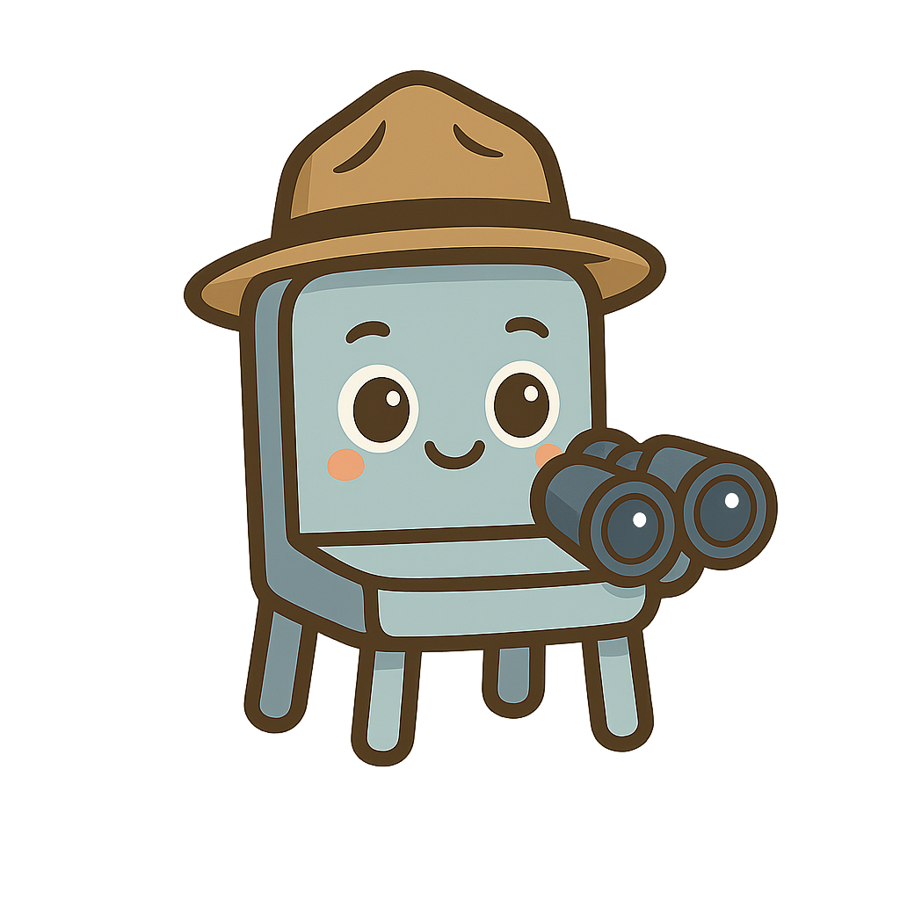

<h1>SeatScout: AI-Powered Live Seat Occupancy Detection</h1>

SeatScout is a real-time seat occupancy detection system designed to solve the common problem of finding available seating in busy public spaces like university libraries, offices, and study areas. Using live or pre-recorded CCTV video feeds, the system leverages a custom-trained YOLOv12 object detection model to identify chairs and people, determines occupancy status, and visualizes the results on a dynamic, user-friendly web dashboard.

## 🚀 Live Demo


## 💡 Key Features

- **Live Occupancy Mapping:** Translates video feed into a real-time 2D map of the room, showing which seats are vacant (🟢) and occupied (🔴).
- **Dual View Modes:**
    - **User View:** A clean, simple interface for end-users to quickly find a seat.
    - **Admin View:** An enhanced view showing the live video feed with bounding boxes for detected objects, providing deeper operational insights.
- **Real-Time Statistics:** Displays key metrics including total seats, occupied/vacant counts, and the number of people detected.
- **Multi-Room Support:** Seamlessly switch between different rooms or camera feeds via a simple dropdown menu.
- **Intelligent Seat Visualization:** Automatically overlays seat status icons onto a room template based on model inference, providing an intuitive bird's-eye view of the space.

## 🛠️ How It Works & Technology Stack

The system processes a video stream frame-by-frame to provide continuous updates. The core pipeline is as follows:

1.  **Object Detection:** A custom-trained **YOLOv12 model** (`seatscout_v5.pt`) detects `chair` and `human` objects in each frame. The model was trained on a custom-generated synthetic dataset, a process detailed in the `seatscout_v5.ipynb` notebook.
2.  **Occupancy Classification:** The system determines if a seat is occupied by calculating the **Intersection over Union (IoU)** between the bounding boxes of a detected `chair` and a `human`. If the overlap exceeds a set threshold, the seat is flagged as occupied.
3.  **Dashboard Visualization:** The results are rendered on an interactive dashboard built with **Streamlit**. The front end displays a 2D template of the room, overlaying icons for each seat's status.

### Core Technologies:
- **Model:** YOLOv12
- **Dashboard:** Streamlit
- **CV Libraries:** OpenCV, Ultralytics
- **Core Libraries:** NumPy, Pillow

## 📂 Project Structure

```
├── dashboard.py                # Main Streamlit application
├── requirements.txt            # Python dependencies
├── seatscout_v5.ipynb          # Jupyter Notebook detailing model training
├── seatscout_v5.pt             # Trained YOLOv12 model weights
├── data.yaml                   # Dataset configuration for YOLO training
├── assets/
│   ├── icons/                  # Icons for dashboard UI
│   ├── room_videos/            # Sample video files for inference
│   └── demo.mp4                # Project demonstration video
└── data/
    └── dataset_v5/             # Custom dataset used for training
```

## 🚀 How to Run

1.  **Clone the repository:**
    ```bash
    git clone https://github.com/your-username/seatscout.git
    cd seatscout
    ```

2.  **Install dependencies:**
    ```bash
    pip install -r requirements.txt
    ```

3.  **Run the Streamlit application:**
    ```bash
    streamlit run dashboard.py
    ```